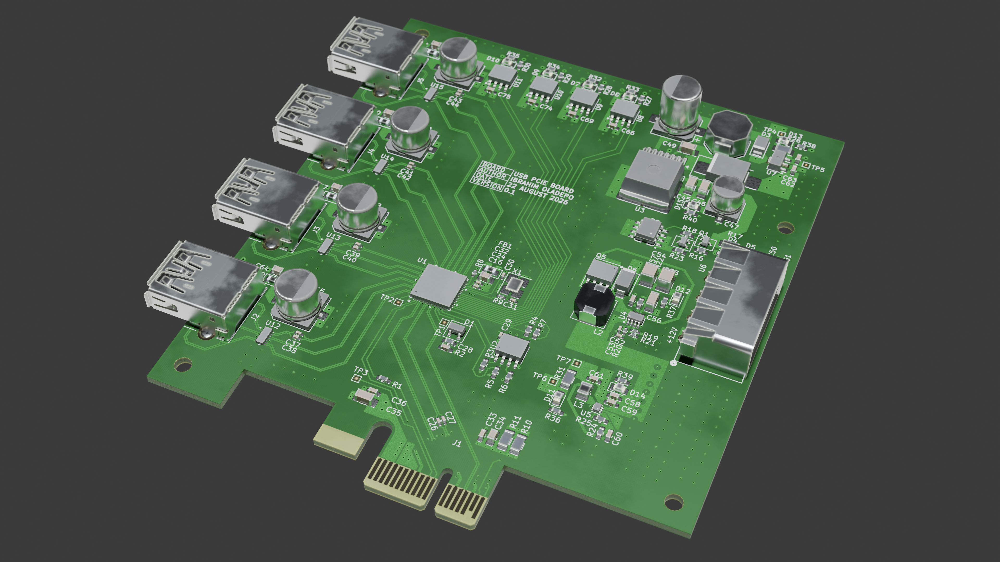
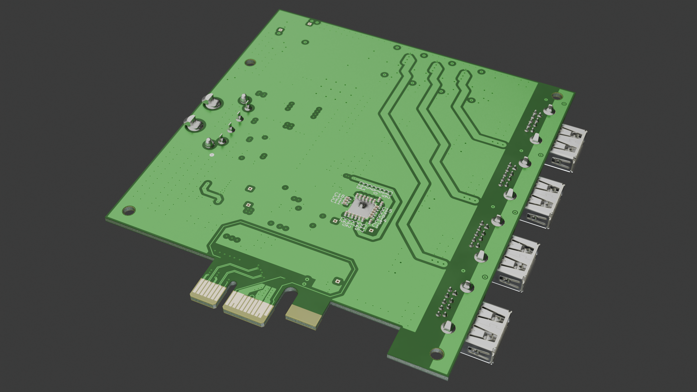
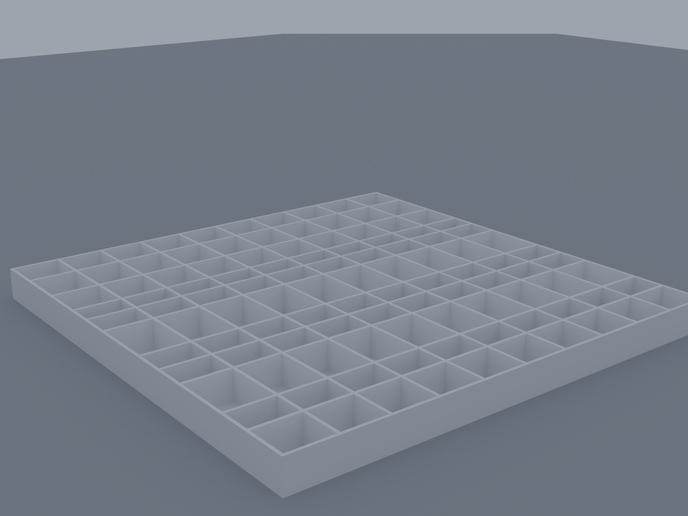
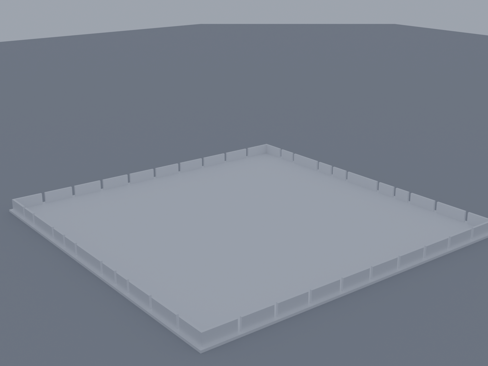

# USB PCIe Expansion Card

A PCI Express x1 to USB 3.0 expansion card, designed in KiCad. Plugs into a PCIe x1
slot and breaks it out to four USB 3.0 Type-A ports.

## Overview

The design is built around **U1**, a Renesas `µPD720201` xHCI USB 3.0 host
controller, which bridges the PCIe link to four independent USB 3.0 ports.

| Function | Reference(s) | Part |
|---|---|---|
| PCIe x1 edge connector | J1 | `Bus_PCI_Express_x1` |
| USB host controller | U1 | Renesas `UPD720201K8-711-BAC-A` |
| Controller firmware/config flash | U2 | `MX25L4006EM1I-12G` (SPI NOR) |
| Controller clock | X1 | 24MHz crystal |
| USB 3.0 Type-A ports | J2–J5 | Molex `48406-0001` |
| Per-port VBUS power switches | U8–U11 | `AP2191SG-13` |
| Per-port ESD protection | U12–U15 | `SP3011-06UTG` |
| Power regulation | U3, U4, U5, U7 | Buck regulators + 3.3V LDO |

Power for the board and its 5V VBUS rails is derived from the PCIe slot's 12V/3.3V
supply through an on-board regulation chain.

## Board

- 4-layer, ~98.6 x 111.9mm
- ~175 components, ~126 nets

| Top | Bottom |
|---|---|
|  |  |

## Component sorting tray

A 150 x 150 x 10mm box-and-lid pair for sorting the BOM by hand before assembly, one
compartment per distinct part/value. Generated with the
[box-stl-generator](https://javisperez.github.io/box-stl-generator/) tool; STL files
are in `3D/Assembly/`. Pair it with `Doc/Component_Tray_Layout.pdf` for a printable,
to-scale cut-out label plus a lookup table mapping each compartment to its BOM entry.

| Box | Lid |
|---|---|
|  |  |

## OS / driver setup

### Windows

Windows Update alone was enough to bring the controller up correctly. In addition, the
[Renesas USB 3.0 Host Controller Driver](https://www.dell.com/support/home/en-fm/drivers/driversdetails?driverid=1ptn7)
(distributed via Dell's driver site) was installed. No manual firmware extraction step
was needed on Windows, unlike Linux.

### Linux

This board uses the Renesas `UPD720201K8-701-BAC-A` PCIe to USB 3.0 host controller. On
Linux, the `xhci-pci-renesas` driver requires a firmware blob to bring the controller
online. That firmware is not distributed through the standard `linux-firmware` package
due to Renesas licensing restrictions, so it has to be installed manually. The steps
below worked on Ubuntu (kernel 7.0.x).

**1. Confirm the board is enumerating on PCIe**

Before touching firmware, confirm the OS sees the chip at all:

```bash
lspci -d 1912:
```

If nothing shows up, this is a hardware bring-up issue (power sequencing, REFCLK/PERST#
timing, card edge connector, or PCIe slot lane availability), not a firmware issue.
Check `sudo dmesg | grep -iE "pci|xhci"` around boot time for enumeration messages
before proceeding.

Once the chip enumerates correctly, you'll see something like:

```
xhci-pci-renesas 0000:01:00.0: probe with driver xhci-pci-renesas failed with error -2
```

The `-2` (ENOENT) confirms the driver bound successfully but could not find the
firmware file.

**2. Get the firmware**

The `linux-firmware` package does not ship `renesas_usb_fw.mem` for this chip family.
Use the community-maintained mirror instead, which repackages the firmware extracted
from Renesas's official Windows update tool along with checksums:

```bash
cd /tmp
wget https://github.com/chunkeey/renesas-fw/raw/master/USB3-201-202-FW-20120615.zip
wget https://github.com/chunkeey/renesas-fw/raw/master/SHA256SUMS
sha256sum -c SHA256SUMS 2>/dev/null | grep -i ok
unzip USB3-201-202-FW-20120615.zip -d renesas-fw-extracted
```

This covers both the uPD720201 and uPD720202 with a single combined firmware image:
`K2013080.mem`.

**3. Install the firmware**

```bash
sudo cp /tmp/renesas-fw-extracted/USB3-201-202-FW-20120615/K2013080.mem /lib/firmware/renesas_usb_fw.mem
file /lib/firmware/renesas_usb_fw.mem   # should report "data", not ASCII/HTML
sudo update-initramfs -u
sudo reboot
```

**4. Verify**

```bash
sudo dmesg | grep -i renesas
lsusb
```

Expected output on success:

```
xhci-pci-renesas 0000:01:00.0: xHCI Host Controller
xhci-pci-renesas 0000:01:00.0: new USB bus registered, assigned bus number 3
xhci-pci-renesas 0000:01:00.0: new USB bus registered, assigned bus number 4
xhci-pci-renesas 0000:01:00.0: Host supports USB 3.0 SuperSpeed
usb 4-1: new SuperSpeed USB device number 2 using xhci-pci-renesas
```

A device plugged into the hub should now show up in `lsusb` as a SuperSpeed device on
the new bus.

**Notes**

- This firmware image is dated 2012. Renesas has released newer versions since; if you
  hit driver errors that this image does not resolve, pull an updated version directly
  from Renesas's site (free account required) rather than a community mirror.
- Because the firmware is not redistributable through `linux-firmware`, this manual
  install step will need to be repeated after a fresh OS install or if `/lib/firmware`
  gets wiped. Consider scripting steps 2 to 3 as a setup script in this repo for future
  bring-up.

## Repository layout

- `USB_PCIE_Board.kicad_pro` / `.kicad_pcb` / `.kicad_sch` — main project, board, and schematic
- `USB_PCIE_BOARD_POWER.kicad_sch` — power supply schematic sheet
- `Doc/` — documentation, including a PCB design review checklist and the component
  tray layout
- `3D/` — Blender renders and STEP/pcb3d exports of the board; `3D/Assembly/` has the
  sorting tray's STL files and renders
- `production/` — generated fabrication outputs (gerbers, BOM, position files)

## Status

Actively being worked through a design review pass (DRC cleanup, courtyard/footprint
fixes, silkscreen check) — see `Doc/PCB_Design_Review_Checklist.md` for the current
punch list.
