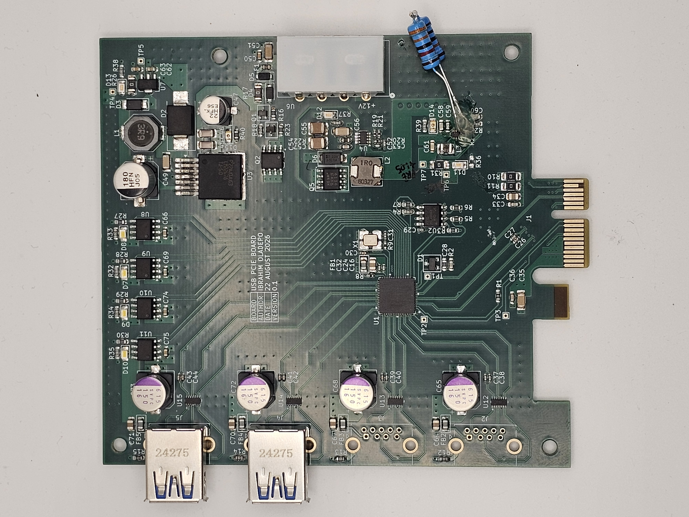
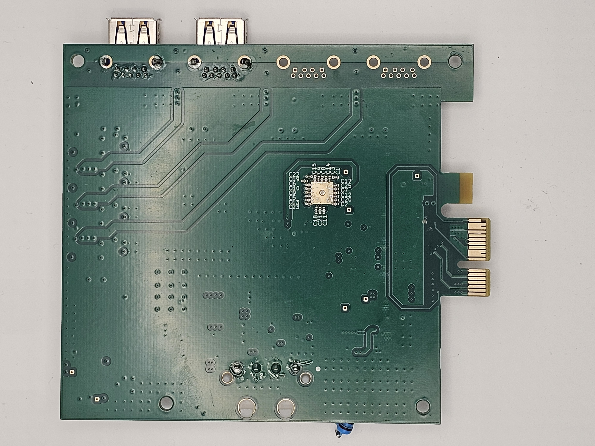
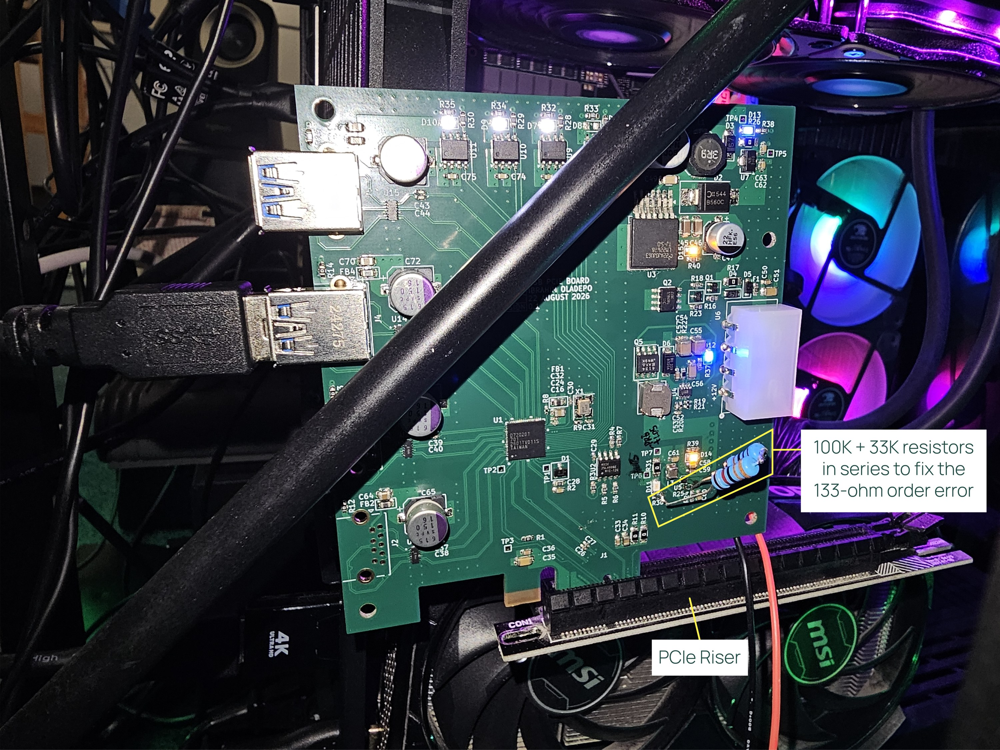
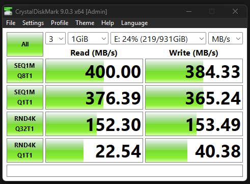

# USB PCIe Expansion Card

A PCI Express x1 to USB 3.0 expansion card, designed in KiCad. Plugs into a PCIe x1
slot and breaks it out to four USB 3.0 Type-A ports.

## Contents

- [Overview](#overview)
- [Board](#board)
- [Design approach](#design-approach)
- [First assembled board (v0.1)](#first-assembled-board-v01)
  - [The R25 bring-up bug and the through-hole fix](#the-r25-bring-up-bug-and-the-through-hole-fix)
  - [Running in a PC](#running-in-a-pc)
  - [Known issues](#known-issues-to-fix-in-the-next-revision)
- [Component sorting tray](#component-sorting-tray)
- [OS / driver setup](#os--driver-setup)
  - [Windows](#windows)
  - [Linux](#linux)
- [Repository layout](#repository-layout)
- [Status](#status)

## Overview

The design is built around **U1**, a Renesas `µPD720201` xHCI USB 3.0 host
controller, which bridges the PCIe link to four independent USB 3.0 ports.

| Function | Reference(s) | Part |
|---|---|---|
| PCIe x1 edge connector | J1 | `Bus_PCI_Express_x1` |
| USB host controller | U1 | Renesas `UPD720201K8-701-BAC-A` |
| Controller firmware/config flash | U2 | `MX25L4006EM1I-12G` (SPI NOR) |
| Controller clock | X1 | 24MHz crystal |
| USB 3.0 Type-A ports | J2–J5 | Molex `48406-0001` |
| Per-port VBUS power switches | U8–U11 | `AP2191SG-13` |
| Per-port ESD protection | U12–U15 | `SP3011-06UTG` |
| Power regulation | U3, U4, U5, U7 | Buck regulators + 3.3V LDO |

Power for the board and its 5V VBUS rails is derived from the PCIe slot's 12V/3.3V
supply through an on-board regulation chain.

## Board

- 4-layer, ~98.6 x 111.9mm
- ~175 components, ~126 nets

| Top | Bottom |
|---|---|
|  |  |

## Design approach

- **All tracks were routed by hand.** No autorouter and no AI-generated routing was
  used.
- **The layer stackup was worked out by me**, following recommendations from
  experts such as Rick Hartley.
- **Claude (Anthropic's AI assistant) was used for repository version control and as
  a second pair of eyes for checking nets for errors.** It did not route or place
  anything. Layout and design decisions are my own.

## First assembled board (v0.1)

| Top | Bottom |
|---|---|
|  |  |

### The R25 bring-up bug and the through-hole fix

The first populated board brought up all rails cleanly except the 1.05V core rail
(U5), which came up equal to its input voltage instead of regulating. Bring-up debug
(solder-bridge check, continuity check, a U5 swap that didn't help) eventually traced
it to the feedback divider: **R25 had been sourced as a 133Ω part instead of the
133kΩ the design called for**, a unit typo (Ω vs kΩ) that slipped through to the BOM
and the order. With R24 (100kΩ, correct) on top and a 133Ω part on the bottom, the
feedback node was pulled to nearly 0V, which made the regulator's control loop drive
close to 100% duty cycle: output tracking input, exactly as observed.

The through-hole resistors visible in the top-view photo (bottom right, near L3/D14)
are the quick fix: a **100kΩ + 33kΩ series pair (133kΩ total)** from parts already on
hand, soldered in place of the bad R25 so the divider is back at its design value
(1.05V output) without waiting on a new part order.

### Running in a PC



The board is plugged into the PC's PCIe slot through a **PCIe riser**, for two
reasons: it makes the board easy to probe with a multimeter while powered, and the
case has no room for the board's USB connector placement when seated directly in the
slot. The annotated photo marks the R25 fix and the riser. The original,
un-annotated photo is
[`2D/Photos/20260920_213102.jpg`](2D/Photos/20260920_213102.jpg).

A 1TB SSD connected to one of the board's USB ports, tested with CrystalDiskMark:



| Test | Read (MB/s) | Write (MB/s) |
|---|---|---|
| SEQ1M Q8T1 | 400.00 | 384.33 |
| SEQ1M Q1T1 | 376.39 | 365.24 |
| RND4K Q32T1 | 152.30 | 153.49 |
| RND4K Q1T1 | 22.54 | 40.38 |

### Known issues (to fix in the next revision)

- **1.05V indicator LED (D11) cannot light.** D11 is a blue `SMLMN2BCTT86C` with a
  forward voltage of about 2.9V, but it is wired across the 1.05V rail, so it can
  never turn on. Note that swapping to a lower-Vf colour will not fix this on its own:
  a red/yellow/green LED still needs roughly 1.8V or more. Options for v0.2: drive
  the LED from +3V3 through a resistor and switch it with a small transistor sensed
  from +1V05, or drop the LED and rely on the TP6/TP7 test points.
- **R25 value.** Re-check the schematic/BOM value and the ordered part for R25 so they
  match the intended 133kΩ before the next order.
- See [`Doc/PCB_Design_Review_Checklist.md`](Doc/PCB_Design_Review_Checklist.md) for the
  rest of the v0.1 review notes.

## Component sorting tray

A 150 x 150 x 10mm box-and-lid pair for sorting the BOM by hand before assembly, one
compartment per distinct part/value. Generated with the
[box-stl-generator](https://javisperez.github.io/box-stl-generator/) tool; STL files
are in `3D/Assembly/`. Pair it with `Doc/Component_Tray_Layout.pdf` for a printable,
to-scale cut-out label plus a lookup table mapping each compartment to its BOM entry.

| Box | Lid |
|---|---|
|  |  |

## OS / driver setup

### Windows

Windows Update alone was enough to bring the controller up correctly. In addition, the
[Renesas USB 3.0 Host Controller Driver](https://www.dell.com/support/home/en-fm/drivers/driversdetails?driverid=1ptn7)
(distributed via Dell's driver site) was installed. No manual firmware extraction step
was needed on Windows, unlike Linux.

### Linux

This board uses the Renesas `UPD720201K8-701-BAC-A` PCIe to USB 3.0 host controller. On
Linux, the `xhci-pci-renesas` driver requires a firmware blob to bring the controller
online. That firmware is not distributed through the standard `linux-firmware` package
due to Renesas licensing restrictions, so it has to be installed manually. The steps
below worked on Ubuntu (kernel 7.0.x).

**1. Confirm the board is enumerating on PCIe**

Before touching firmware, confirm the OS sees the chip at all:

```bash
lspci -d 1912:
```

If nothing shows up, this is a hardware bring-up issue (power sequencing, REFCLK/PERST#
timing, card edge connector, or PCIe slot lane availability), not a firmware issue.
Check `sudo dmesg | grep -iE "pci|xhci"` around boot time for enumeration messages
before proceeding.

Once the chip enumerates correctly, you'll see something like:

```
xhci-pci-renesas 0000:01:00.0: probe with driver xhci-pci-renesas failed with error -2
```

The `-2` (ENOENT) confirms the driver bound successfully but could not find the
firmware file.

**2. Get the firmware**

The `linux-firmware` package does not ship `renesas_usb_fw.mem` for this chip family.
Use the community-maintained mirror instead, which repackages the firmware extracted
from Renesas's official Windows update tool along with checksums:

```bash
cd /tmp
wget https://github.com/chunkeey/renesas-fw/raw/master/USB3-201-202-FW-20120615.zip
wget https://github.com/chunkeey/renesas-fw/raw/master/SHA256SUMS
sha256sum -c SHA256SUMS 2>/dev/null | grep -i ok
unzip USB3-201-202-FW-20120615.zip -d renesas-fw-extracted
```

This covers both the uPD720201 and uPD720202 with a single combined firmware image:
`K2013080.mem`.

**3. Install the firmware**

```bash
sudo cp /tmp/renesas-fw-extracted/USB3-201-202-FW-20120615/K2013080.mem /lib/firmware/renesas_usb_fw.mem
file /lib/firmware/renesas_usb_fw.mem   # should report "data", not ASCII/HTML
sudo update-initramfs -u
sudo reboot
```

**4. Verify**

```bash
sudo dmesg | grep -i renesas
lsusb
```

Expected output on success:

```
xhci-pci-renesas 0000:01:00.0: xHCI Host Controller
xhci-pci-renesas 0000:01:00.0: new USB bus registered, assigned bus number 3
xhci-pci-renesas 0000:01:00.0: new USB bus registered, assigned bus number 4
xhci-pci-renesas 0000:01:00.0: Host supports USB 3.0 SuperSpeed
usb 4-1: new SuperSpeed USB device number 2 using xhci-pci-renesas
```

A device plugged into the hub should now show up in `lsusb` as a SuperSpeed device on
the new bus.

**Notes**

- This firmware image is dated 2012. Renesas has released newer versions since; if you
  hit driver errors that this image does not resolve, pull an updated version directly
  from Renesas's site (free account required) rather than a community mirror.
- Because the firmware is not redistributable through `linux-firmware`, this manual
  install step will need to be repeated after a fresh OS install or if `/lib/firmware`
  gets wiped. Consider scripting steps 2 to 3 as a setup script in this repo for future
  bring-up.

## Repository layout

- `USB_PCIE_Board.kicad_pro` / `.kicad_pcb` / `.kicad_sch` — main project, board, and schematic
- `USB_PCIE_BOARD_POWER.kicad_sch` — power supply schematic sheet
- `Doc/` — documentation, including a PCB design review checklist and the component
  tray layout
- `2D/` — board edge outline drawings (`.dxf` / `.ai`), and `2D/Photos/` with photos of
  the assembled v0.1 board and its bring-up
- `3D/` — Blender renders and STEP/pcb3d exports of the board; `3D/Assembly/` has the
  sorting tray's STL files and renders
- `bom/` — interactive HTML BOM (`ibom.html`)
- `production/` — generated fabrication outputs (gerbers, BOM, position files)

## Status

Actively being worked through a design review pass (DRC cleanup, courtyard/footprint
fixes, silkscreen check) — see `Doc/PCB_Design_Review_Checklist.md` for the current
punch list.
